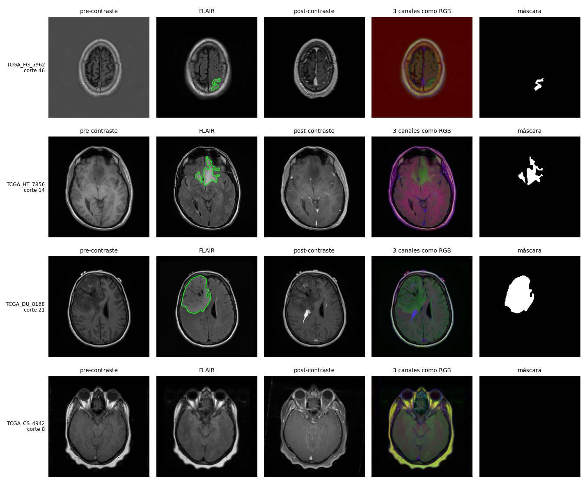
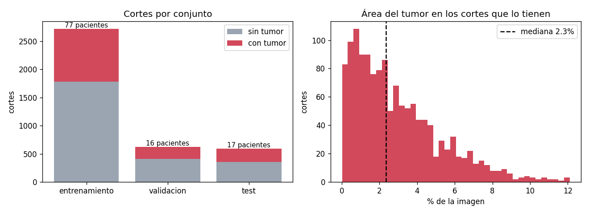
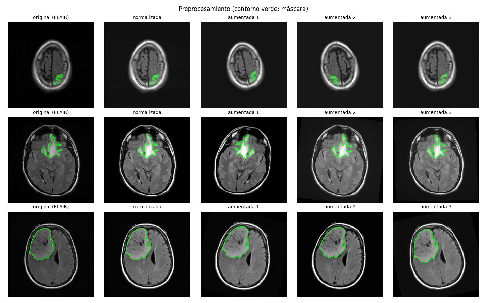
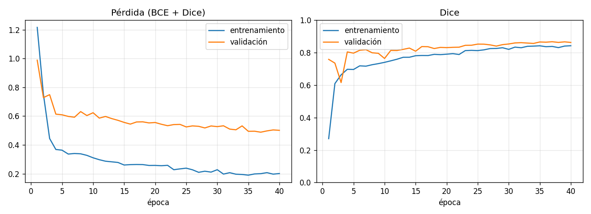
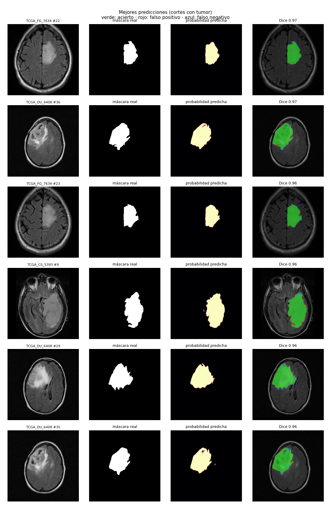
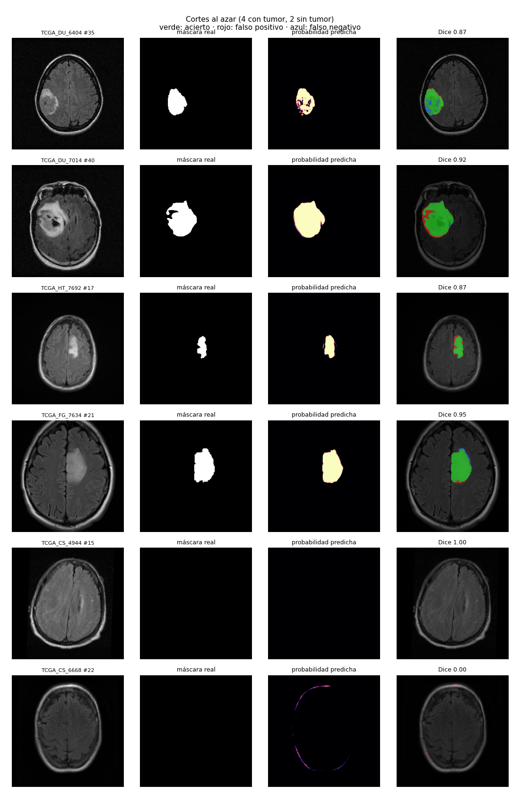
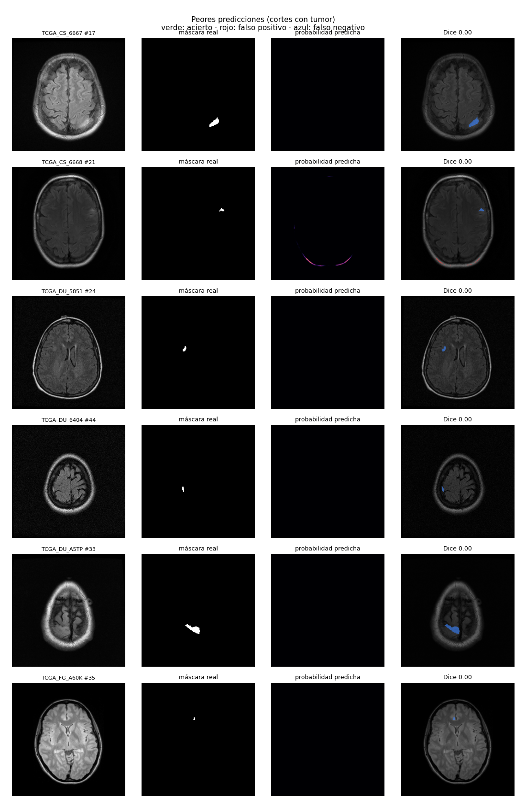
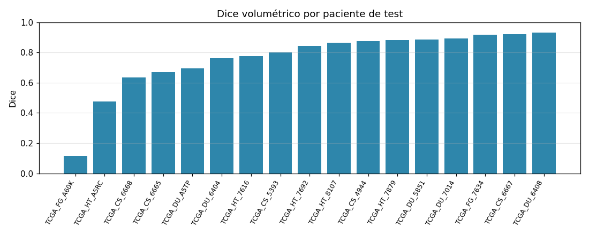

# TP4 - Segmentación de tumores cerebrales con U-Net

## Temática

Elegimos segmentar gliomas de bajo grado en resonancias magnéticas de cerebro.
Los gliomas son tumores que se originan en las células de la glía. Los de bajo
grado crecen lento y tienen bordes difusos, por lo que marcarlos a mano corte
por corte lleva mucho tiempo y el resultado cambia según quién lo haga. Esa
segmentación se usa después para planificar cirugías o radioterapia y para
seguir la evolución del tumor.

La idea es que la red reciba un corte de resonancia y devuelva una máscara con
los píxeles donde está la anomalía que se ve en la secuencia FLAIR (en FLAIR el
tumor y el edema se ven más claros). Es segmentación binaria: tumor o fondo.

## Cómo correrlo

Desde la carpeta `tp4-segmentacion`, usando el venv de la raíz del repo (en Git
Bash; en PowerShell es igual pero con `..\venv\Scripts\python.exe`):

```bash
# instalar dependencias (una vez). torch con CUDA para usar la GPU
../venv/Scripts/python.exe -m pip install torch torchvision --index-url https://download.pytorch.org/whl/cu118
../venv/Scripts/python.exe -m pip install -r requirements.txt

../venv/Scripts/python.exe src/descargar_datos.py    # baja el dataset a datos/ (~700 MB)
../venv/Scripts/python.exe src/visualizar_datos.py   # figuras del dataset y del preprocesamiento
../venv/Scripts/python.exe src/entrenar.py           # entrena (40 épocas, ~25 min en una RTX 3060)
../venv/Scripts/python.exe src/evaluar.py            # métricas y figuras sobre test
```

Para probar rápido que todo funciona se puede entrenar pocas épocas con
`src/entrenar.py --epocas 2`. También acepta `--tamano`, `--batch`, `--lr`,
`--base` y `--workers` (si el DataLoader da problemas en Windows, usar
`--workers 0`). `python src/unet.py` arma la red sola e imprime la cantidad de
parámetros.

Todo lo que se genera queda en `resultados/`. El modelo (`modelo.pt`) y el
dataset (`datos/`) no se suben al repo.

## Dataset

Usamos LGG MRI Segmentation de Kaggle
(https://www.kaggle.com/datasets/mateuszbuda/lgg-mri-segmentation), publicado por
Buda et al. (2019) con imágenes de The Cancer Imaging Archive.

Son 110 pacientes y 3929 cortes axiales de 256x256 en formato tif. Cada imagen
tiene 3 canales que corresponden a tres secuencias de resonancia: pre-contraste,
FLAIR y post-contraste. Cuando a un paciente le falta alguna secuencia, el
dataset la reemplaza por FLAIR. Cada corte tiene su máscara binaria hecha a mano.

Solo el 35% de los cortes tiene tumor, y en esos el tumor ocupa en mediana el
2,3% de la imagen, así que hay mucho más fondo que tumor.




Un detalle: OpenCV lee los tif en orden BGR, entonces al leer se invierten los
canales para que queden en el orden del dataset.

## Preprocesamiento

Está en `src/datos.py`.

- Redimensionamiento: las imágenes ya vienen en 256x256 y trabajamos en ese
  tamaño. Se puede bajar a 128 con `--tamano 128`. La máscara se redimensiona
  con vecino más cercano para que siga siendo binaria.
- Normalización: cada canal de cada imagen se lleva a media 0 y desvío 1. En
  resonancia los valores de intensidad dependen del equipo y del protocolo, así
  que no se pueden comparar directamente entre pacientes. La media y el desvío
  se calculan solo sobre los píxeles de la cabeza para que el fondo negro no
  influya.
- Data augmentation (solo en entrenamiento): espejo horizontal, rotación de
  hasta 15 grados, escala entre 0,9 y 1,1, y cambios de brillo y contraste. Las
  transformaciones geométricas se aplican igual a la imagen y a la máscara.



Tuvimos un problema con la normalización. En la primera corrida el Dice de
validación dio 0 durante varias épocas mientras que el de entrenamiento subía.
Revisando, el modelo andaba bien en modo `train()` pero en `eval()` no predecía
nada, y la primera capa de BatchNorm tenía una varianza acumulada de ~68000. El
problema era que en 23 cortes el canal post-contraste es constante, entonces al
dividir por el desvío (casi 0) quedaban valores de hasta 200000 que arruinaban
las estadísticas de BatchNorm. Lo resolvimos dejando en 0 los canales
constantes y recortando la imagen normalizada a [-5, 5].

## División de los datos

Dividimos 70/15/15 por paciente, no por corte. Si se divide por corte, cortes
vecinos de un mismo cerebro (que son casi iguales) pueden quedar uno en
entrenamiento y otro en test, y el resultado de test da mejor de lo que es.

| Conjunto | Pacientes | Cortes | Con tumor |
|---|---|---|---|
| Entrenamiento | 77 | 2719 | 34% |
| Validación | 16 | 621 | 34% |
| Test | 17 | 589 | 39% |

La semilla es fija, así que la división siempre es la misma
(`resultados/particion.txt` tiene la lista de pacientes). Validación se usa para
elegir la mejor época y bajar el learning rate; test se usa solo al final.

## Modelo

U-Net implementada desde cero en `src/unet.py`. Tiene 4 niveles de bajada con
32, 64, 128 y 256 filtros (cada nivel son dos convoluciones 3x3 con BatchNorm y
ReLU, y después max pooling), un cuello de 512 filtros, y 4 niveles de subida
con convolución transpuesta y concatenación con el nivel correspondiente de la
bajada. La salida es una convolución 1x1 a un canal. En total son 7,8 millones
de parámetros.

A diferencia del paper original usamos padding en las convoluciones (así la
salida tiene el mismo tamaño que la entrada) y agregamos BatchNorm.

## Entrenamiento

- Pérdida: BCE + Dice. Con BCE sola la red puede predecir todo fondo y tener
  una pérdida baja, porque el tumor es muy chico. El término Dice penaliza eso.
- Adam con learning rate 1e-3, batch de 16, 40 épocas. Si el Dice de validación
  no mejora en 5 épocas se divide el learning rate por 2.
- Precisión mixta en GPU para que sea más rápido (~30 s por época).
- Se guarda el modelo de la época con mejor Dice de validación.



El mejor Dice de validación fue 0,866 en la época 37. Las curvas se estabilizan
alrededor de la época 30 y no se ve sobreajuste: el Dice de validación no baja.

La pérdida de validación queda por encima de la de entrenamiento aunque el Dice
de validación es más alto. Esto se debe a cómo se calcula la pérdida: el término
Dice se calcula por batch, y los batches de validación no se mezclan (los cortes
van en orden), así que 14 de los 39 batches no tienen ningún tumor. En esos
batches el Dice da cerca de 0 aunque el modelo no prediga nada, y la pérdida
queda cerca de 1. En entrenamiento los batches se mezclan y casi siempre tienen
algún corte con tumor. El Dice de entrenamiento es un poco más bajo que el de
validación porque se calcula sobre imágenes con augmentation.

## Resultados en test

| Métrica | Valor |
|---|---|
| Dice medio por corte (todos) | 0,792 |
| Dice medio por corte (solo cortes con tumor) | 0,662 |
| IoU medio por corte (solo cortes con tumor) | 0,573 |
| Dice por paciente (volumen 3D), promedio | 0,761 |
| Cortes con tumor detectados | 204 de 230 (89%) |
| Cortes sin tumor con falso positivo | 45 de 359 (13%) |

Cuando un corte no tiene tumor y el modelo no predice nada, contamos Dice = 1.
El Dice por paciente se calcula apilando todos los cortes del paciente como un
volumen. El detalle de cada paciente está en `resultados/metricas_test.txt`.

En las figuras: verde es acierto, rojo es falso positivo y azul es falso
negativo.






## Discusión

Con tumores grandes y bien visibles en FLAIR el modelo funciona muy bien (en
los mejores cortes el Dice da 0,96-0,97) y los errores se concentran en el borde del tumor, que es
justamente donde la máscara manual también es más discutible.

Los errores más importantes son en tumores chicos. Los peores cortes son todos
casos con pocos píxeles de tumor donde el modelo no
predice nada, y por eso el Dice es 0. En los cortes de los extremos del tumor
pasa lo mismo. Esto también se ve por paciente: el peor (TCGA_FG_A60K, Dice
0,12) tiene como máximo 629 píxeles de tumor por corte, mientras que el mejor
(TCGA_DU_6408, Dice 0,93) llega a 5400. Por eso el Dice medio por corte con
tumor (0,66) es bastante más bajo que el Dice por paciente: los cortes chicos
pesan lo mismo que los grandes en el promedio.

Los falsos positivos aparecen sobre todo en el borde del cráneo, que en FLAIR se
ve brillante como el tumor (se ve en TCGA_CS_6668 en las figuras). Esto se
podría mejorar con post-procesamiento, por ejemplo borrando las regiones chicas
o las que quedan en el borde de la cabeza.

Otras limitaciones:

- La red trabaja con cada corte por separado y no usa los cortes vecinos. Un
  radiólogo mira el volumen completo, y eso ayuda a decidir si una mancha chica
  es tumor o no.
- Algunos pacientes no tienen todas las secuencias y el canal faltante es una
  copia de FLAIR, así que la red ve entradas distintas para esos casos.
- El test tiene 17 pacientes, entonces un paciente difícil cambia bastante el
  promedio.
- El umbral de 0,5 no lo ajustamos. Bajándolo probablemente se detecten más
  tumores chicos a cambio de más falsos positivos.

Como referencia, el paper del dataset (Buda et al., 2019) reporta un Dice medio
de 0,82 con un modelo y post-procesamiento más elaborados, así que nuestro 0,76 es razonable para una U-Net básica en 2D.

## Qué falta hacer

Hecho:

- [x] Elegir el problema y el dataset
- [x] Preprocesamiento, con figuras de ejemplo
- [x] U-Net desde cero
- [x] División por paciente en entrenamiento, validación y test
- [x] Entrenamiento y curvas de pérdida
- [x] Evaluación sobre test y comparación de predicciones con máscaras reales
- [x] Discusión de los resultados

Para la entrega:

- [ ] Commitear las figuras nuevas de `resultados/` (predicciones, dice por
      paciente, métricas) junto con este README
- [ ] Armar el informe o la presentación con las figuras de `resultados/`
- [ ] Revisar la redacción (está escrito en plural; cambiarlo si el TP es
      individual)
- [ ] Chequear el dato del paper de referencia (Buda et al., 2019, Dice 0,82)
      antes de citarlo

Mejoras opcionales, si sobra tiempo:

- [ ] Ajustar el umbral (ahora 0,5) usando validación, y ver cómo cambian la
      detección de tumores chicos y los falsos positivos
- [ ] Post-procesamiento: borrar regiones predichas muy chicas o pegadas al
      borde del cráneo, que es donde aparecen la mayoría de los falsos positivos
- [ ] Usar los cortes vecinos como entrada extra, para que la red tenga algo
      de información 3D
- [ ] Comparar con una U-Net con encoder preentrenado (por ejemplo ResNet34)
- [ ] Entrenar sin augmentation para ver cuánto aporta

## Archivos

```
tp4-segmentacion/
├── src/
│   ├── descargar_datos.py    descarga el dataset
│   ├── datos.py              lectura, división por paciente y preprocesamiento
│   ├── unet.py               la red
│   ├── metricas.py           pérdida y métricas (Dice, IoU)
│   ├── visualizar_datos.py   figuras del dataset
│   ├── entrenar.py           entrenamiento
│   └── evaluar.py            evaluación sobre test
├── datos/                    dataset (no se sube)
└── resultados/               figuras, métricas y modelo
```
